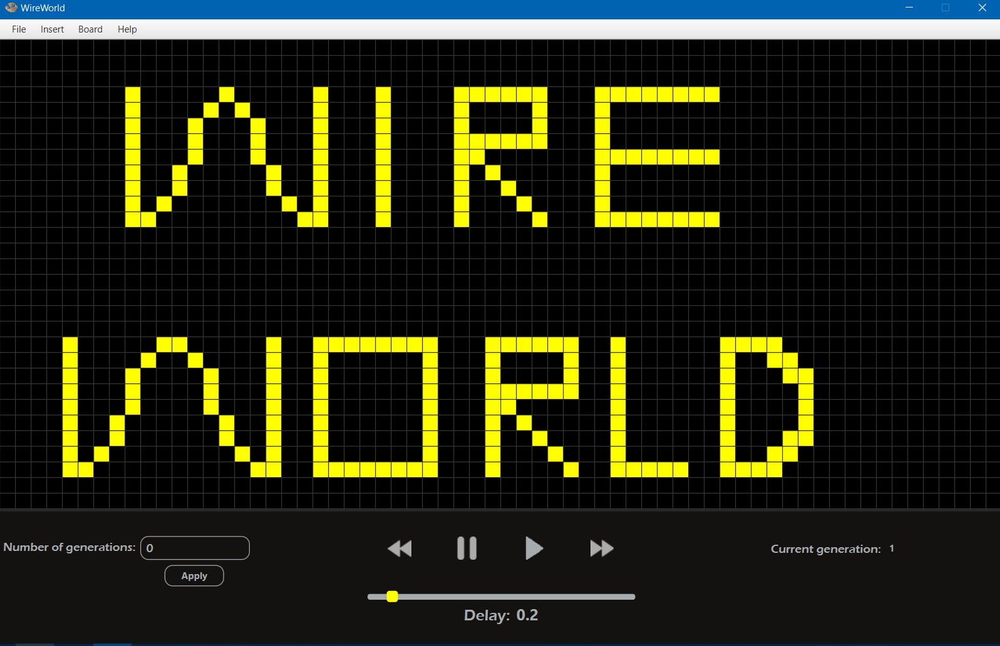

# Wireworld

Implementation of cellular automata based on Brian Silverman's Wireworld.

## Built With

* [Java](https://java.com/)
* JavaFX
* [AssertJ](http://joel-costigliola.github.io/assertj/)

## Version

2.0

## Features

* drawing electrical circuits on the board using left and right mouse buttons,
* drawing conductors with left mouse button and CTRL pressed
* removing conductors with left mouse button and SHIFT pressed
* creating setted up number of generations,
* loading generations from png and bmp file,
* saving generations to png and bmp file,
* 3 sizes of the wireworld board,
* inserting AND, OR, XOR, NOT, NAND logic gates in 4 directions,

* clearing board,
* changing speed of simulation,
* restoring up to 6 previous generations,
* pausing and unpausing simulation,
* creating single next generation manually.

## Authors
* [Konrad Magiera](https://github.com/KonradMagiera)
* [Kamil Kwapisz](https://github.com/KamilKwapisz)

## License

This project is licensed under the MIT License - see the [LICENSE.md](LICENSE) file for details

